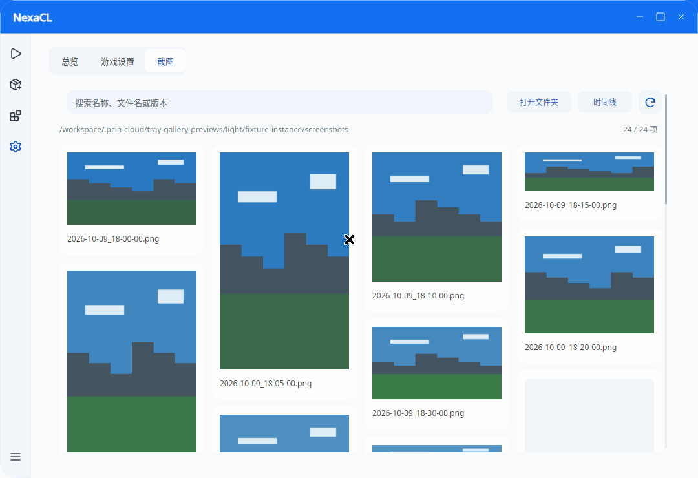
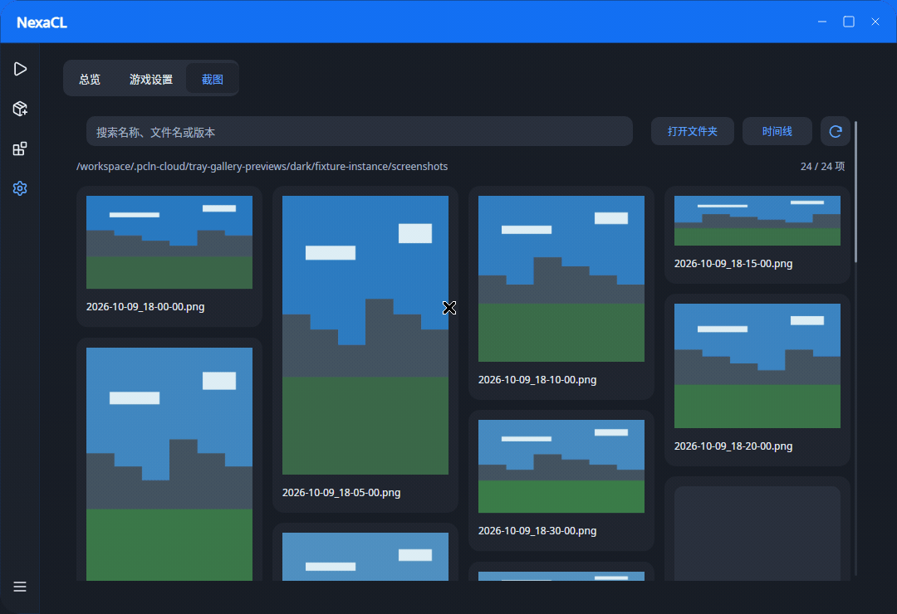

# Firefly Alpha 6 截图库与托盘预览

预览来自实际产品设置页控制器、渲染器和原生 X11 窗口，使用受控的本地合成 PNG 素材，覆盖横图、竖图与方图。原始录制以 1080×740、30 fps 连续采集；GIF 由录制转换，未用静态截图拼接。

全部图片为 1080×740，点击链接查看原图：

| 界面 | 亮色 | 暗色 |
| --- | --- | --- |
| 截图库 | [gallery-light.png](gallery-light.png)（46,018 B） | [gallery-dark.png](gallery-dark.png)（48,297 B） |
| 放大查看 | [enlarged-light.png](enlarged-light.png)（26,444 B） | [enlarged-dark.png](enlarged-dark.png)（26,715 B） |
| 裁剪界面 | [crop-light.png](crop-light.png)（40,275 B） | [crop-dark.png](crop-dark.png)（41,113 B） |

录制包含截图库浏览、放大与裁剪界面，以及同一原生窗口的托盘动画隐藏和恢复。窗口隐藏后出现的黑色画面是 Xvfb 空桌面的预期结果。

亮色：317 帧，10.56 秒，464,575 B。

暗色：349 帧，11.63 秒，393,629 B。

GIF 的帧数和时长已用 `identify` 与 `ffprobe` 核对；帧延时为 3 或 4 厘秒，无重复播放扩展，单次播放。

复制、分享、打开文件夹与裁剪按钮仅展示实际界面；采集夹具中的这些动作为空操作，录制不证明剪贴板写入、分享、文件夹打开或裁剪输出成功。Linux/Xvfb 图像不证明 Windows DWM 外观；Windows 验证另由 CI 执行。
